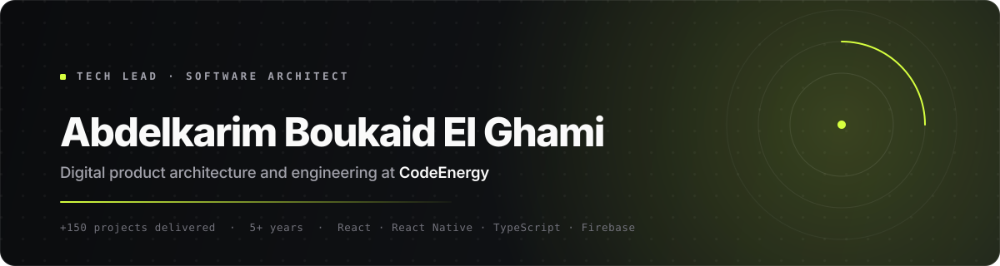

[Español](./README.md) &nbsp;·&nbsp; **English** &nbsp;·&nbsp; [Français](./README.fr.md)

<a href="https://codeenergy.org">
  <picture>
    <source media="(prefers-color-scheme: dark)" srcset="./assets/header-en-dark.svg">
    <source media="(prefers-color-scheme: light)" srcset="./assets/header-en-light.svg">
    
  </picture>
</a>

 

 

> **Technology should drive your business, not hold it back.**
>
> I design and build platforms that survive real growth: web, mobile and cloud infrastructure.
> Over **5 years** leading teams and **+150 projects** delivered for startups, SMEs and founders.

 

## What I do

| Area | What I deliver | Core stack |
| :--- | :--- | :--- |
| **Web product** | SSR and headless platforms, internal dashboards, e-commerce and SaaS | Next.js · React · TypeScript |
| **Mobile apps** | Native and hybrid apps shipped to the App Store and Google Play | Flutter · React Native |
| **Cloud infrastructure** | Serverless architecture, CI/CD, observability and cost control | Google Cloud · Firebase · Node.js |
| **Technical consulting** | Code audits, performance, security and migration planning | Lighthouse · Trivy · k6 |

 

## Projects in production

| Project | What it is | Link |
| :--- | :--- | :--- |
| **AtlasCine** | Audiovisual content platform with catalogue and streaming playback | [atlascine.com](https://atlascine.com) |
| **Bivu** | Service-oriented digital product with its own management dashboard | [bivu.es](https://bivu.es) |
| **CodeEnergy** | Software engineering studio: strategy, design and development | [codeenergy.org](https://codeenergy.org) |

 

## Stack

<table>
  <tr>
    <td><b>Frontend</b></td>
    <td>
      
      
      
      
    </td>
  </tr>
  <tr>
    <td><b>Mobile</b></td>
    <td>
      
      
      
    </td>
  </tr>
  <tr>
    <td><b>Backend</b></td>
    <td>
      
      
      
    </td>
  </tr>
  <tr>
    <td><b>Cloud &amp; DevOps</b></td>
    <td>
      
      
      
      
    </td>
  </tr>
</table>

 

## How I work

<b>The process, in four phases</b>

 

**1 · Discovery.** I understand the business before the code. Goals, users, constraints and what success actually means.

**2 · Architecture.** Decisions written down and justified: stack, data model, system boundaries and estimated running cost.

**3 · Incremental delivery.** Working versions from week one, with automated tests and continuous deployment.

**4 · Operation.** Monitoring, a performance budget and a clear maintenance plan. The project does not end at handover.

<b>Principles I don't negotiate</b>

 

- **Measurable performance.** Core Web Vitals in the green and load tests before production, not after.
- **Security by default.** Audited dependencies, secrets out of the repository and least privilege.
- **Code someone else can maintain.** Documented decisions and zero dependencies that don't earn their place.

 

## Activity

<!-- Remove this block if you'd rather not show metrics while the profile has few public repositories. -->

<picture>
  <source media="(prefers-color-scheme: dark)" srcset="https://github-readme-stats.vercel.app/api?username=codeenergy&show_icons=true&count_private=true&hide_border=true&bg_color=00000000&title_color=D6FF3F&icon_color=D6FF3F&text_color=A1A1AA">
  
</picture>
<picture>
  <source media="(prefers-color-scheme: dark)" srcset="https://github-readme-stats.vercel.app/api/top-langs/?username=codeenergy&layout=compact&hide_border=true&bg_color=00000000&title_color=D6FF3F&text_color=A1A1AA">
  
</picture>

 

## Let's talk

> [!NOTE]
> I take on a limited number of clients at a time to keep delivery standards high.
> If you have a project in mind, write to me with the context and I'll reply with an initial technical assessment, no strings attached.

**Email** · [info@codeenergy.org](mailto:info@codeenergy.org) &nbsp;&nbsp;|&nbsp;&nbsp; **Web** · [codeenergy.org](https://codeenergy.org) &nbsp;&nbsp;|&nbsp;&nbsp; **LinkedIn** · [Abdelkarim Boukaid El Ghami](https://www.linkedin.com/in/abdelkarimboukaidelghami)

 

Built with engineering judgement · <b>CodeEnergy</b>

