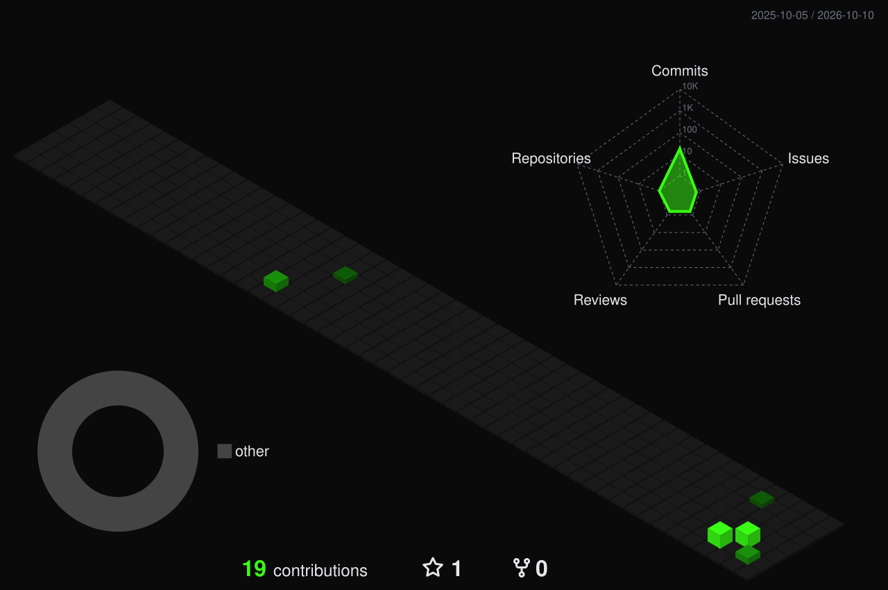

[Español](./README.md) &nbsp;·&nbsp; **English** &nbsp;·&nbsp; [Français](./README.fr.md)

 

<!-- ⚡ HERO -->

  

<!-- 🛠 WHAT I BUILD · PORTFOLIO -->

  

<!-- ⚙️ TECH STACK -->

  

<!-- 🪪 ID + DASHBOARD -->

  

## ⚡ Featured projects

| Project | What it is | Stack | Status |
|:---|:---|:---|:---:|
| [**AtlasCine**](https://atlascine.com) | Movies, series and anime portal with a real TMDB catalogue, in 4 languages (including RTL Arabic) | `JavaScript` `Firestore` `TMDB API` `GitHub Actions` `Vercel` | 🟢 In production |
| [**Bivu**](https://www.bivu.es) | AI ERP for SMBs: POS, inventory, CRM and VERI\*FACTU invoicing, with the Vega assistant | `React 19` `TypeScript` `Vite` `Tailwind` `Firebase` `Gemini` `Stripe` | 🟢 In production |
| [**YamYam IA**](https://yamyam.codeenergy.org) | Calories, recipes and workouts in a single app, with an AI chef | `React Native` `Expo` `TypeScript` `Firebase` `Gemini` | 🟡 Website live · stores soon |
| [**SpiderCode**](https://spidercode.codeenergy.org) | 60 educational games and 3,000 levels for kids aged 5 to 12 | `React Native` `Expo` `TypeScript` `Firebase` `EAS` | 🟡 Website live · stores soon |
| [**CodeEnergy**](https://codeenergy.org) | The agency's own site: catalogue, Stripe payments, client dashboard and n8n automations, in ES/EN/FR | `Next.js 16` `React 19` `Firebase` `Stripe` `n8n` `Vercel` | 🟢 In production |

## 🧭 How I work

<b>The process, in four phases</b>

 

**1 · Discovery.** I understand the business before the code. Goals, users, constraints and what success actually means.

**2 · Architecture.** Decisions written down and justified: stack, data model, system boundaries and estimated running cost.

**3 · Incremental delivery.** Working versions from week one, with automated tests and continuous deployment.

**4 · Operation.** Monitoring, a performance budget and a clear maintenance plan. The project does not end at handover.

<b>Principles I don't negotiate</b>

 

- **Measurable performance.** Core Web Vitals in the green and load tests before production, not after.
- **Security by default.** Audited dependencies, secrets out of the repository and least privilege.
- **Code someone else can maintain.** Documented decisions and zero dependencies that don't earn their place.

> [!NOTE]
> Most of my work lives in private client repositories, under non-disclosure agreements.
> What you can evaluate is live in production: **[atlascine.com](https://atlascine.com)**, **[bivu.es](https://www.bivu.es)** and **[codeenergy.org](https://codeenergy.org)**.
> If you need to review code before working with me, get in touch and I'll prepare a representative extract or a technical walkthrough.

 

## 🌃 My contribution city

*Every commit builds another tower — rebuilt automatically every day.*

  

<!-- 💬 CONTACT -->

  

  

**Built with engineering judgement.** ⚡

Tech Lead & Software Architect · <a href="https://www.linkedin.com/in/abdelkarimboukaidelghami">Abdelkarim Boukaid El Ghami</a>

