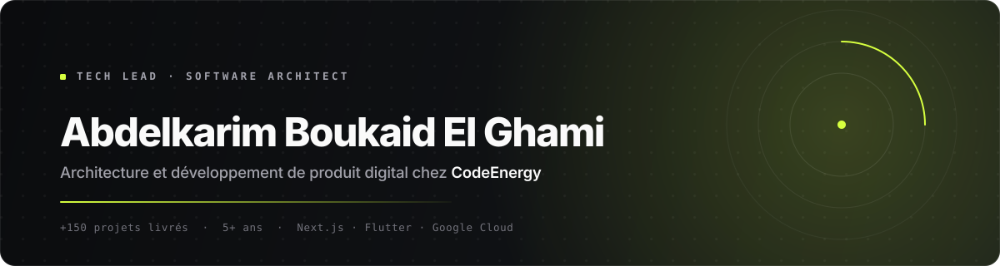

[Español](./README.md) &nbsp;·&nbsp; [English](./README.en.md) &nbsp;·&nbsp; **Français**

<a href="https://codeenergy.org">
  <picture>
    <source media="(prefers-color-scheme: dark)" srcset="./assets/header-fr-dark.svg">
    <source media="(prefers-color-scheme: light)" srcset="./assets/header-fr-light.svg">
    
  </picture>
</a>

 

 

> **La technologie doit être le moteur de votre activité, pas son frein.**
>
> Je conçois et construis des plateformes qui tiennent face à une croissance réelle : web, mobile et infrastructure cloud.
> Plus de **5 ans** à diriger des équipes et **+150 projets** livrés pour des startups, des PME et des entrepreneurs.

 

## Ce que je fais

| Domaine | Ce que je livre | Stack principale |
| :--- | :--- | :--- |
| **Produit web** | Plateformes SSR et headless, back-offices, e-commerce et SaaS | Next.js · React · TypeScript |
| **Applications mobiles** | Applications iOS et Android avec Expo : authentification, notifications push et abonnements in-app | React Native · Expo · TypeScript |
| **Interfaces produit** | SPAs rapides, design responsive, animation et visualisation de données | React · Vite · Tailwind |
| **Intégration de l'IA** | Fonctionnalités génératives dans le produit : contenu, assistants et automatisation | Google Gemini |
| **Backend et paiements** | Authentification, base de données temps réel, APIs et abonnements | Firebase · Node.js · Stripe |
| **Conseil technique** | Audit de code, performance, sécurité et plans de migration | Lighthouse · Trivy · k6 |

 

## Projets en production

| Projet | De quoi il s'agit | Lien |
| :--- | :--- | :--- |
| **AtlasCine** | Plateforme de contenu audiovisuel avec catalogue et lecture en streaming | [atlascine.com](https://atlascine.com) |
| **Bivu** | Produit digital orienté service, avec son propre back-office | [bivu.es](https://bivu.es) |
| **CodeEnergy** | Studio d'ingénierie logicielle : stratégie, design et développement | [codeenergy.org](https://codeenergy.org) |

 

## Stack

<table>
  <tr>
    <td><b>Frontend</b></td>
    <td>
      
      
      
      
      
    </td>
  </tr>
  <tr>
    <td><b>Mobile</b></td>
    <td>
      
      
      
    </td>
  </tr>
  <tr>
    <td><b>Interface et visualisation</b></td>
    <td>
      
      
      
    </td>
  </tr>
  <tr>
    <td><b>Backend et données</b></td>
    <td>
      
      
      
      
    </td>
  </tr>
  <tr>
    <td><b>Cloud et services</b></td>
    <td>
      
      
      
    </td>
  </tr>
</table>

 

## Ma méthode

<b>Le processus, en quatre phases</b>

 

**1 · Découverte.** Je comprends l'activité avant le code. Objectifs, utilisateurs, contraintes et définition concrète du succès.

**2 · Architecture.** Des décisions écrites et justifiées : stack, modèle de données, limites du système et coût d'exploitation estimé.

**3 · Livraison incrémentale.** Des versions fonctionnelles dès la première semaine, avec tests automatisés et déploiement continu.

**4 · Exploitation.** Supervision, budget de performance et plan de maintenance clair. Le projet ne s'arrête pas à la livraison.

<b>Des principes non négociables</b>

 

- **Performance mesurable.** Core Web Vitals au vert et tests de charge avant la mise en production, pas après.
- **Sécurité par défaut.** Dépendances auditées, secrets hors du dépôt et moindre privilège.
- **Un code maintenable par quelqu'un d'autre.** Décisions documentées et zéro dépendance injustifiée.

 

## Code et confidentialité

> [!NOTE]
> L'essentiel de mon travail se trouve dans des dépôts clients privés, sous accord de confidentialité.
> Ce que vous pouvez évaluer est en production : **[atlascine.com](https://atlascine.com)**, **[bivu.es](https://bivu.es)** et **[codeenergy.org](https://codeenergy.org)**.
> Si vous devez examiner du code avant de travailler avec moi, écrivez-moi et je prépare un extrait représentatif ou une présentation technique.

 

## Parlons-en

> [!NOTE]
> Je travaille avec un nombre limité de clients à la fois afin de maintenir le niveau de livraison.
> Si vous avez un projet en tête, écrivez-moi avec le contexte et je vous réponds par une première évaluation technique, sans engagement.

**E-mail** · [info@codeenergy.org](mailto:info@codeenergy.org) &nbsp;&nbsp;|&nbsp;&nbsp; **Web** · [codeenergy.org](https://codeenergy.org) &nbsp;&nbsp;|&nbsp;&nbsp; **LinkedIn** · [Abdelkarim Boukaid El Ghami](https://www.linkedin.com/in/abdelkarimboukaidelghami)

 

Conçu avec une exigence d'ingénierie · <b>CodeEnergy</b>

