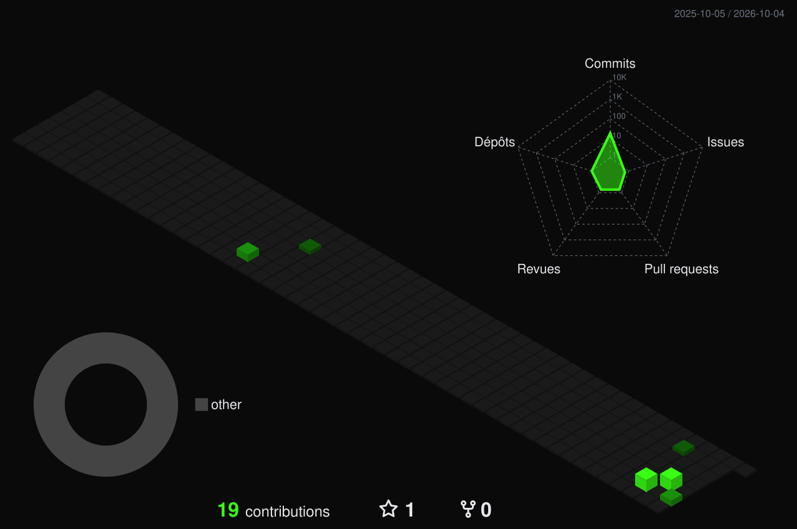

[Español](./README.md) &nbsp;·&nbsp; [English](./README.en.md) &nbsp;·&nbsp; **Français**

 

<!-- ⚡ HERO -->

  

<!-- 🛠 WHAT I BUILD · PORTFOLIO -->

  

<!-- ⚙️ TECH STACK -->

  

<!-- 🪪 ID + DASHBOARD -->

  

## ⚡ Projets phares

| Projet | De quoi s'agit-il | Stack | Statut |
|:---|:---|:---|:---:|
| [**AtlasCine**](https://atlascine.com) | Portail de films, séries et anime avec le catalogue réel de TMDB, en 4 langues (dont l’arabe RTL) | `JavaScript` `Firestore` `TMDB API` `GitHub Actions` `Vercel` | 🟢 En production |
| [**Bivu**](https://www.bivu.es) | ERP avec IA pour PME : caisse, stock, CRM et facturation VERI\*FACTU, avec l’assistant Vega | `React 19` `TypeScript` `Vite` `Tailwind` `Firebase` `Gemini` `Stripe` | 🟢 En production |
| [**YamYam IA**](https://yamyam.codeenergy.org) | Calories, recettes et entraînement dans une seule app, avec un chef IA | `React Native` `Expo` `TypeScript` `Firebase` `Gemini` | 🟡 Site en ligne · stores bientôt |
| [**SpiderCode**](https://spidercode.codeenergy.org) | 60 jeux éducatifs et 3 000 niveaux pour les enfants de 5 à 12 ans | `React Native` `Expo` `TypeScript` `Firebase` `EAS` | 🟡 Site en ligne · stores bientôt |
| [**CodeEnergy**](https://codeenergy.org) | Le site de l'agence : catalogue, paiements Stripe, espace client et automatisations n8n, en ES/EN/FR | `Next.js 16` `React 19` `Firebase` `Stripe` `n8n` `Vercel` | 🟢 En production |

## 🧭 Ma méthode

<b>Le processus, en quatre phases</b>

 

**1 · Découverte.** Je comprends l'activité avant le code. Objectifs, utilisateurs, contraintes et définition concrète du succès.

**2 · Architecture.** Des décisions écrites et justifiées : stack, modèle de données, limites du système et coût d'exploitation estimé.

**3 · Livraison incrémentale.** Des versions fonctionnelles dès la première semaine, avec tests automatisés et déploiement continu.

**4 · Exploitation.** Supervision, budget de performance et plan de maintenance clair. Le projet ne s'arrête pas à la livraison.

<b>Des principes non négociables</b>

 

- **Performance mesurable.** Core Web Vitals au vert et tests de charge avant la mise en production, pas après.
- **Sécurité par défaut.** Dépendances auditées, secrets hors du dépôt et moindre privilège.
- **Un code maintenable par quelqu'un d'autre.** Décisions documentées et zéro dépendance injustifiée.

> [!NOTE]
> L'essentiel de mon travail se trouve dans des dépôts clients privés, sous accord de confidentialité.
> Ce que vous pouvez évaluer est en production : **[atlascine.com](https://atlascine.com)**, **[bivu.es](https://www.bivu.es)** et **[codeenergy.org](https://codeenergy.org)**.
> Si vous devez examiner du code avant de travailler avec moi, écrivez-moi et je prépare un extrait représentatif ou une présentation technique.

 

## 🌃 Ma ville de contributions

*Chaque commit élève une nouvelle tour — régénérée automatiquement chaque jour.*

  

<!-- 💬 CONTACT -->

  

  

**Construit avec une rigueur d’ingénieur.** ⚡

Tech Lead & Software Architect · <a href="https://www.linkedin.com/in/abdelkarimboukaidelghami">Abdelkarim Boukaid El Ghami</a>

