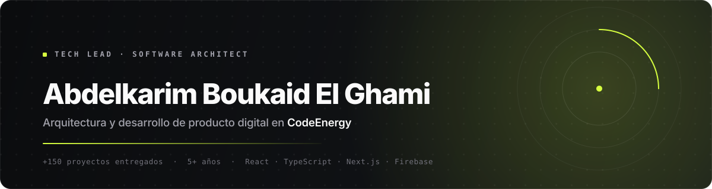

**Español** &nbsp;·&nbsp; [English](./README.en.md) &nbsp;·&nbsp; [Français](./README.fr.md)

<a href="https://codeenergy.org">
  <picture>
    <source media="(prefers-color-scheme: dark)" srcset="./assets/header-es-dark.svg">
    <source media="(prefers-color-scheme: light)" srcset="./assets/header-es-light.svg">
    
  </picture>
</a>

 

 

> **La tecnología debe ser el motor, no el freno de tu negocio.**
>
> Diseño y construyo plataformas que aguantan crecimiento real: web, móvil e infraestructura cloud.
> Más de **5 años** liderando equipos y **+150 proyectos** entregados para startups, pymes y emprendedores.

 

## Qué hago

| Área | Qué entrego | Stack principal |
| :--- | :--- | :--- |
| **Producto web** | Plataformas SSR y headless, paneles internos, e-commerce y SaaS | Next.js · React · TypeScript |
| **Aplicaciones móviles** | Apps nativas e híbridas publicadas en App Store y Google Play | Flutter · React Native |
| **Infraestructura cloud** | Arquitectura serverless, CI/CD, observabilidad y control de coste | Google Cloud · Firebase · Node.js |
| **Consultoría técnica** | Auditoría de código, rendimiento, seguridad y planes de migración | Lighthouse · Trivy · k6 |

 

## Proyectos en producción

| Proyecto | Qué es | Enlace |
| :--- | :--- | :--- |
| **AtlasCine** | Plataforma de contenido audiovisual con catálogo y reproducción en streaming | [atlascine.com](https://atlascine.com) |
| **Bivu** | Producto digital orientado a servicio, con panel de gestión propio | [bivu.es](https://bivu.es) |
| **CodeEnergy** | Estudio de ingeniería de software: estrategia, diseño y desarrollo | [codeenergy.org](https://codeenergy.org) |

 

## Stack

<table>
  <tr>
    <td><b>Frontend</b></td>
    <td>
      
      
      
      
    </td>
  </tr>
  <tr>
    <td><b>Móvil</b></td>
    <td>
      
      
      
    </td>
  </tr>
  <tr>
    <td><b>Backend</b></td>
    <td>
      
      
      
    </td>
  </tr>
  <tr>
    <td><b>Cloud &amp; DevOps</b></td>
    <td>
      
      
      
      
    </td>
  </tr>
</table>

 

## Cómo trabajo

<b>El proceso, en cuatro fases</b>

 

**1 · Descubrimiento.** Entiendo el negocio antes que el código. Objetivos, usuarios, restricciones y qué define el éxito.

**2 · Arquitectura.** Decisiones escritas y justificadas: stack, modelo de datos, límites del sistema y coste estimado de operación.

**3 · Entrega incremental.** Versiones funcionales desde la primera semana, con pruebas automatizadas y despliegue continuo.

**4 · Operación.** Monitorización, presupuesto de rendimiento y un plan claro de mantenimiento. El proyecto no termina al entregar.

<b>Principios que no negocio</b>

 

- **Rendimiento medible.** Core Web Vitals en verde y pruebas de carga antes de producción, no después.
- **Seguridad por defecto.** Dependencias auditadas, secretos fuera del repositorio y mínimo privilegio.
- **Código que otro pueda mantener.** Documentación de decisiones y cero dependencias que no se justifiquen.

 

## Código y confidencialidad

> [!NOTE]
> La mayor parte de mi trabajo vive en repositorios privados de cliente, bajo acuerdo de confidencialidad.
> Lo que sí puedes evaluar está en producción: **[atlascine.com](https://atlascine.com)**, **[bivu.es](https://bivu.es)** y **[codeenergy.org](https://codeenergy.org)**.
> Si necesitas revisar código antes de trabajar conmigo, escríbeme y preparo un extracto representativo o una sesión técnica.

 

## Hablemos

> [!NOTE]
> Trabajo con un número limitado de clientes a la vez para mantener el nivel de entrega.
> Si tienes un proyecto en mente, escríbeme con el contexto y te respondo con una primera valoración técnica sin compromiso.

**Correo** · [info@codeenergy.org](mailto:info@codeenergy.org) &nbsp;&nbsp;|&nbsp;&nbsp; **Web** · [codeenergy.org](https://codeenergy.org) &nbsp;&nbsp;|&nbsp;&nbsp; **LinkedIn** · [Abdelkarim Boukaid El Ghami](https://www.linkedin.com/in/abdelkarimboukaidelghami)

 

Construido con criterio de ingeniería · <b>CodeEnergy</b>

