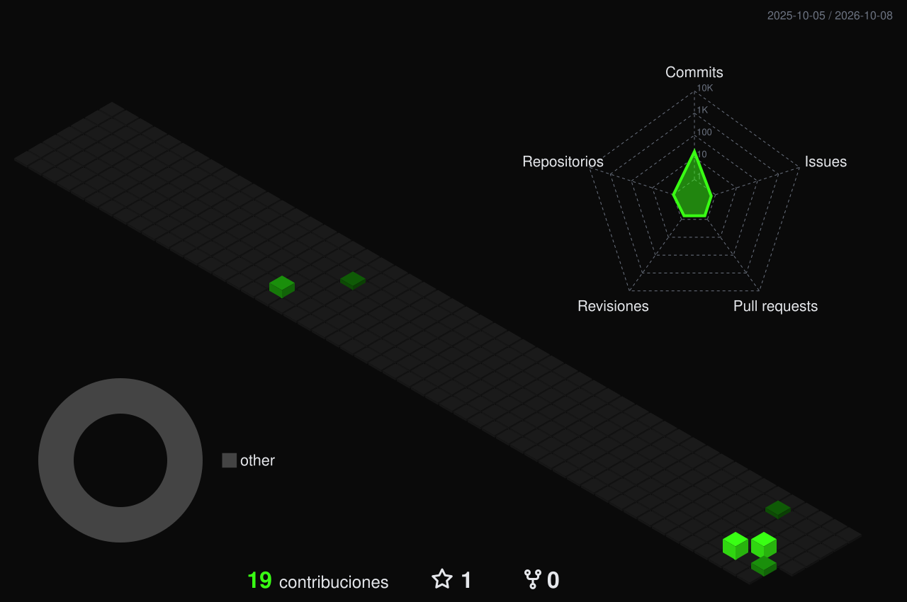

**Español** &nbsp;·&nbsp; [English](./README.en.md) &nbsp;·&nbsp; [Français](./README.fr.md)

 

<!-- ⚡ HERO -->

  

<!-- 🛠 WHAT I BUILD · PORTFOLIO -->

  

<!-- ⚙️ TECH STACK -->

  

<!-- 🪪 ID + DASHBOARD -->

  

## ⚡ Proyectos destacados

| Proyecto | Qué es | Stack | Estado |
|:---|:---|:---|:---:|
| [**AtlasCine**](https://atlascine.com) | Portal de películas, series y anime con catálogo real de TMDB, en 4 idiomas (incluido árabe RTL) | `JavaScript` `Firestore` `TMDB API` `GitHub Actions` `Vercel` | 🟢 En producción |
| [**Bivu**](https://www.bivu.es) | ERP con IA para pymes: TPV, inventario, CRM y facturación VERI\*FACTU, con el asistente Vega | `React 19` `TypeScript` `Vite` `Tailwind` `Firebase` `Gemini` `Stripe` | 🟢 En producción |
| [**YamYam IA**](https://yamyam.codeenergy.org) | Calorías, recetas y entrenamiento en una sola app, con chef IA | `React Native` `Expo` `TypeScript` `Firebase` `Gemini` | 🟡 Web en línea · tiendas próximamente |
| [**SpiderCode**](https://spidercode.codeenergy.org) | 60 juegos educativos y 3.000 niveles para niños de 5 a 12 años | `React Native` `Expo` `TypeScript` `Firebase` `EAS` | 🟡 Web en línea · tiendas próximamente |
| [**CodeEnergy**](https://codeenergy.org) | La web de la agencia: catálogo, pagos con Stripe, panel de cliente y automatizaciones n8n, en ES/EN/FR | `Next.js 16` `React 19` `Firebase` `Stripe` `n8n` `Vercel` | 🟢 En producción |

## 🧭 Cómo trabajo

<b>El proceso, en cuatro fases</b>

 

**1 · Descubrimiento.** Entiendo el negocio antes que el código. Objetivos, usuarios, restricciones y qué define el éxito.

**2 · Arquitectura.** Decisiones escritas y justificadas: stack, modelo de datos, límites del sistema y coste estimado de operación.

**3 · Entrega incremental.** Versiones funcionales desde la primera semana, con pruebas automatizadas y despliegue continuo.

**4 · Operación.** Monitorización, presupuesto de rendimiento y un plan claro de mantenimiento. El proyecto no termina al entregar.

<b>Principios que no negocio</b>

 

- **Rendimiento medible.** Core Web Vitals en verde y pruebas de carga antes de producción, no después.
- **Seguridad por defecto.** Dependencias auditadas, secretos fuera del repositorio y mínimo privilegio.
- **Código que otro pueda mantener.** Documentación de decisiones y cero dependencias que no se justifiquen.

> [!NOTE]
> La mayor parte de mi trabajo vive en repositorios privados de cliente, bajo acuerdo de confidencialidad.
> Lo que sí puedes evaluar está en producción: **[atlascine.com](https://atlascine.com)**, **[bivu.es](https://www.bivu.es)** y **[codeenergy.org](https://codeenergy.org)**.
> Si necesitas revisar código antes de trabajar conmigo, escríbeme y preparo un extracto representativo o una sesión técnica.

 

## 🌃 Mi ciudad de contribuciones

*Cada commit levanta otra torre — se regenera automáticamente cada día.*

  

<!-- 💬 CONTACT -->

  

  

**Construido con criterio de ingeniería.** ⚡

Tech Lead & Software Architect · <a href="https://www.linkedin.com/in/abdelkarimboukaidelghami">Abdelkarim Boukaid El Ghami</a>

